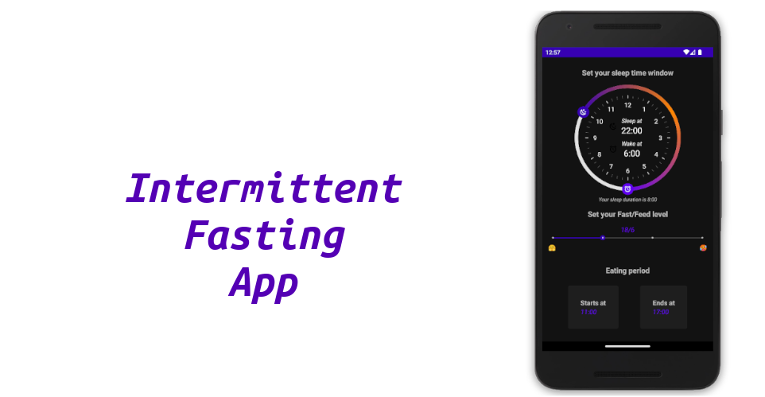

# Interfast

[Intermittent Fasting](https://www.healthline.com/nutrition/intermittent-fasting-guide#methods) (IF)
is an eating pattern that cycles between periods of fasting and eating.  
Get your eating period according to your _sleeping schedule_ and _Fast/Feed target_.

# To-do

- [x] Calculate eating period
- [X] Selected settings persistence
- [ ] Eating period slider
- [ ] Support for other [IF types](https://en.wikipedia.org/wiki/Intermittent_fasting#Types)
    - [X] Time restricted feeding (16/8; 18/6; 20/4; 22/2)
    - [ ] OMAD
    - [ ] 5:2 method
    - [ ] Alternate day
- [ ] Eat/Fast time Countdown

# Download

Or get the APK from the [Releases Section](https://github.com/Husseinfo/interfast/releases/latest).
